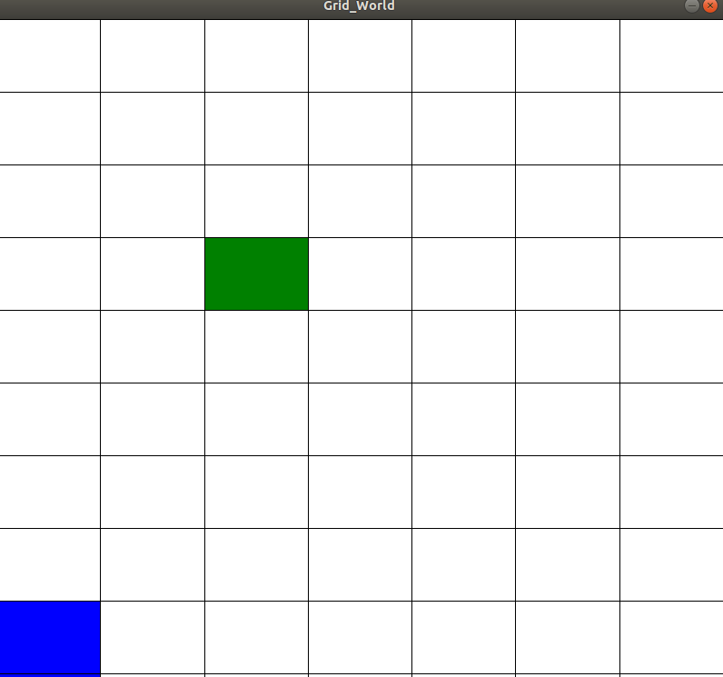

# How to Run My Code
All it requires is Python 3 \n

# Description
I created a grid world, similiar to OpenAI gym's, and implemented basic Q-Learning. 

# Video
Describe the Video here
[(https://www.youtube.com/watch?v=NLY9B3Y2eho  "My Agent Learning to Reach the Green Block")

## Tensorflow Setup Instructions
Instructions on how to setup Tensorflow and the virtual enviroment
https://linuxize.com/post/how-to-install-tensorflow-on-ubuntu-18-04/

source venv/bin/activate

