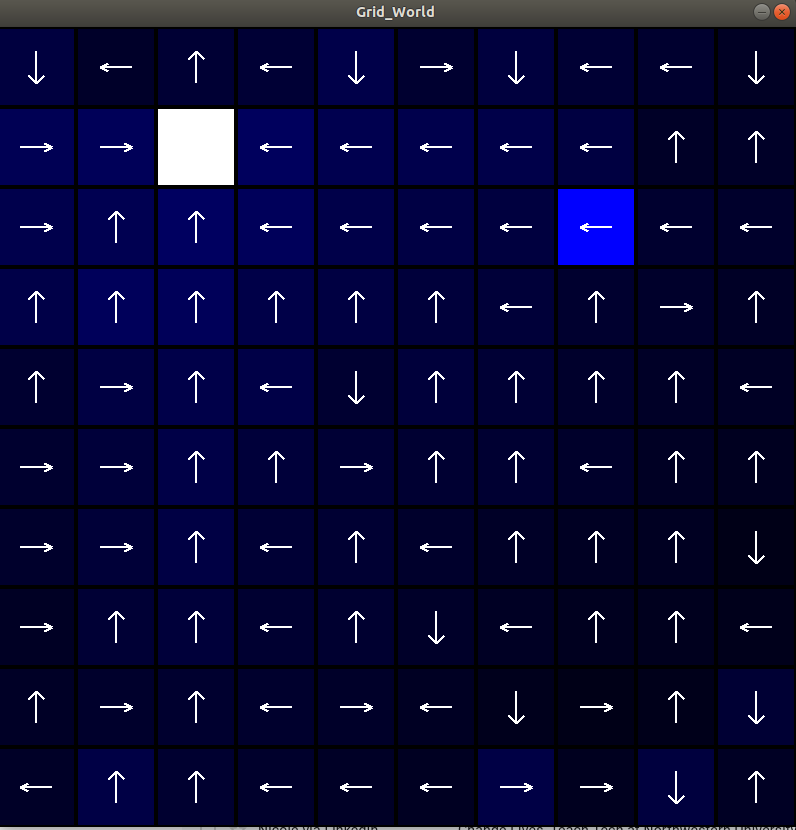

# How to Run My Code
All it requires is Python 3 and Tensorflow/Keras. To run my code, execute ```python3 myAgent.py```

# Description
I created a grid world, similiar to OpenAI gym's, and implemented basic two Q-Learning algorithms. First, I implemented Q-Learning using a Q-table. I then implemented Q-Learning using a neural network to store the table.

# Results
This is a link to a video of the agent learning to reach the white goal state. The video first shows the agent using the Q Table and then I show the agent using the neural network to learn the same function. The Q-Table code is in the master branch. The neural network Q-Learning approach is in the DeepQ branch.

Below is a graphical representation of the policy learned by the Q-Table agent. The blue channel of the grid cell is proportional to the agent's expected discounted reward from the given cell. (https://www.youtube.com/watch?v=0iWIOUMrzAk&feature=youtu.be)
[](https://www.youtube.com/watch?v=0iWIOUMrzAk&feature=youtu.be "Q-Learning in GridWorld")

Below is a graphical representation of the policy learned by the neural network Q-Learning agent. 
[](https://github.com/PeterJochem/Grid_World_RL/blob/master/NN_Large.png "Neural Network Q-Learning in GridWorld")

### Tensorflow and Virtual Env Setup Instructions
It is easiest to run Tensorflow from a virtual enviroment on Linux. Here are instructions on how to setup Tensorflow and the virtual enviroment
https://linuxize.com/post/how-to-install-tensorflow-on-ubuntu-18-04/

To activate the virtual enviroment:  ```source venv/bin/activate```


